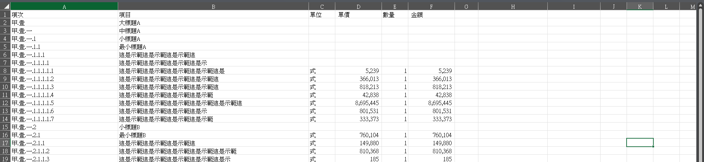
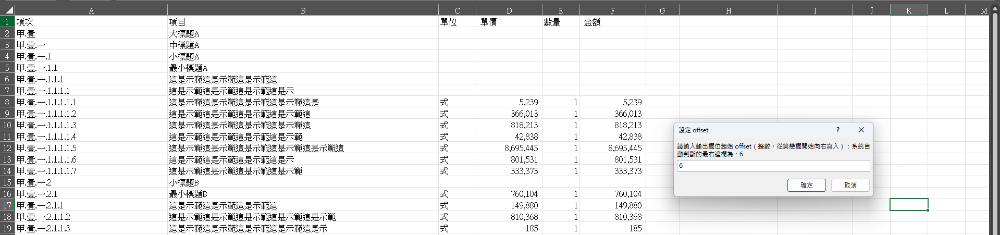
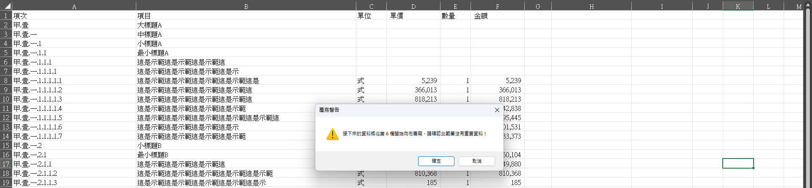
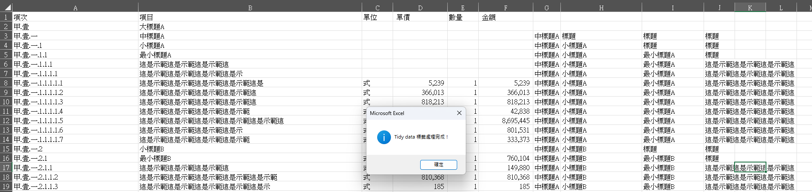

## 將PCCES巢狀結構快速製作TidyData
用正則化分析出大中小標題，並將他們整理成TidyData的方式貼到每一列，以方便作樞紐分析表或sumifs等用途。

使用方法:  
* 請務必備份檔案或資料後再執行
* ALT+F11打開VBA介面
* 在左方的專案Project找到要新增的檔案->模組->插入->模組
* 有需要請自訂Pattern和哨兵符號
* 貼上VBA就可以執行了
* 目前是使用ActiveSheet也就是使用中工作表

*原本狀態(測試過，不一定要合併儲存格也能用)*

*VBA會問你，這些Label要填在哪個column(請確認右方都是空格或垃圾資料)，他會提醒你目前最右方的Column+1，或是你可以用公式 = column確認*

*再請確認一遍*

*結果如下:*

  
```VBA
Option Explicit

Sub TidyDataLabels()
    Dim ws As Worksheet
    Set ws = ActiveSheet
    
    Dim inOff As Variant
    Dim off As Long
    Dim resp As VbMsgBoxResult
    Dim lastCol As Long
    Dim GuardStr As String
    
    ' =========README===========
    ' 這會幫巢狀結構建立Label讓他變成TidyData
    ' 目前的Pattern僅供參考，有需要改成自己的格式即可
    ' 沒有子Label的cell(本身就是標題列)會用"標題"兩個字來當衛兵佔位符號，可以修改GuardStr的初始化
    ' ==========================
    
    '─── 1. 讀取並驗證 offset ─────────────────────────
    lastCol = ws.UsedRange.Columns(ws.UsedRange.Columns.Count).column
    Do
        inOff = Application.InputBox( _
            Prompt:="請輸入輸出欄位起始 offset（整數，從第幾欄開始向右寫入）：系統自動判斷的最右邊欄為：" & lastCol, _
            Title:="設定 offset", Type:=1)
        If inOff = False Then Exit Sub    ' 使用者按「取消」
        If IsNumeric(inOff) And inOff >= 1 Then
            off = CLng(inOff)
            Exit Do
        Else
            MsgBox "請輸入正整數！", vbExclamation
        End If
    Loop
    
    resp = MsgBox( _
        "接下來的資料將從第 " & off & " 欄開始向右覆寫，請確認此範圍沒有重要資料！", _
        vbExclamation + vbOKCancel, "覆寫警告")
    If resp = vbCancel Then Exit Sub
    
    ' 初始化衛兵符號
    GuardStr = "標題"
    
    '─── 2. 建立三個正則物件 ────────────────────────────
    Dim re1 As Object, re2 As Object, re3 As Object, re4 As Object
    Set re1 = CreateObject("VBScript.RegExp")
    Set re2 = CreateObject("VBScript.RegExp")
    Set re3 = CreateObject("VBScript.RegExp")
    Set re4 = CreateObject("VBScript.RegExp")
    
    With re1
        .Pattern = "^[甲癸酉子丑]\.[壹貳參肆伍]\.[一二三四五六七八九十]+$"
        .Global = False
    End With
    With re2
        .Pattern = "^[甲癸酉子丑]\.[壹貳參肆伍]\.[一二三四五六七八九十]+\.\d+$"
        .Global = False
    End With
    With re3
        .Pattern = "^[甲癸酉子丑]\.[壹貳參肆伍]\.[一二三四五六七八九十]+\.\d+\.\d+$"
        .Global = False
    End With
    With re4
        .Pattern = "^[甲癸酉子丑]\.[壹貳參肆伍]\.[一二三四五六七八九十]+\.\d+\.\d+\.\d+$"
        .Global = False
    End With
    
    '─── 3. 掃描 A 欄，將符合層級的原文貼到 offset+n ─────────
    Dim lastRow As Long
    lastRow = ws.Cells(ws.Rows.Count, "A").End(xlUp).row
    '清空範圍
    ws.Range(ws.Cells(1, off + 1), ws.Cells(lastRow, off + 4)).Clear
    
    
    Dim i As Long
    Dim j As Long
    Dim txt As String
    Dim content As String
    
    For i = 2 To lastRow
        txt = CStr(ws.Cells(i, "A").Value)
        content = ws.Cells(i, 2).Value
        
        If re1.test(txt) Then
            ws.Cells(i, off + 1).Value = content
            For j = 2 To 4
                ws.Cells(i, off + j).Value = GuardStr
            Next j
        End If
        If re2.test(txt) Then
            ws.Cells(i, off + 2).Value = content
            ws.Cells(i, off + 3).Value = GuardStr
            ws.Cells(i, off + 4).Value = GuardStr
        End If
        If re3.test(txt) Then
            ws.Cells(i, off + 3).Value = content
            ws.Cells(i, off + 4).Value = GuardStr
        End If
        If re4.test(txt) Then
            ws.Cells(i, off + 4).Value = content
        End If
    Next i
    
    '─── 4. 各欄向下填滿空白 ───────────────────────────
    Dim col As Long, data() As Variant
    For col = off + 1 To off + 4
        data = ws.Range(ws.Cells(2, col), ws.Cells(lastRow, col)).Value
        For i = 2 To UBound(data, 1)
            If IsEmpty(data(i, 1)) Then
                data(i, 1) = data(i - 1, 1)
            End If
        Next i
        ws.Range(ws.Cells(2, col), ws.Cells(lastRow, col)).Value = data
    Next col

    MsgBox "Tidy data 標籤處理完成！", vbInformation
End Sub

```


```
